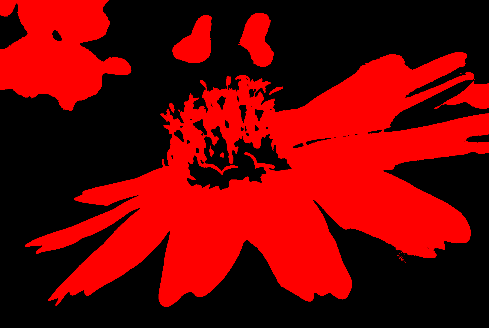
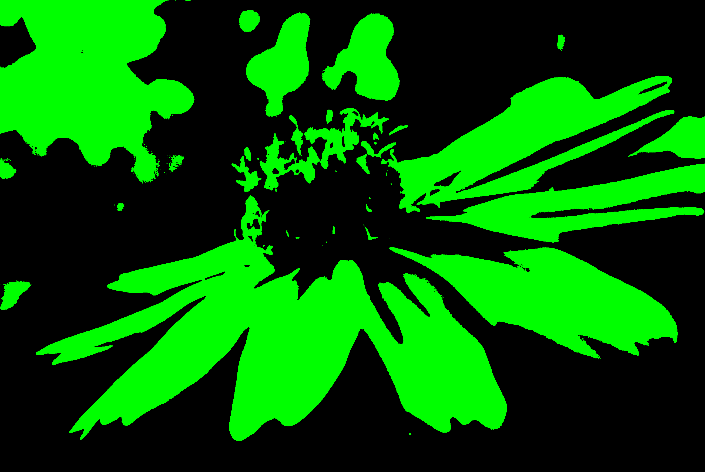
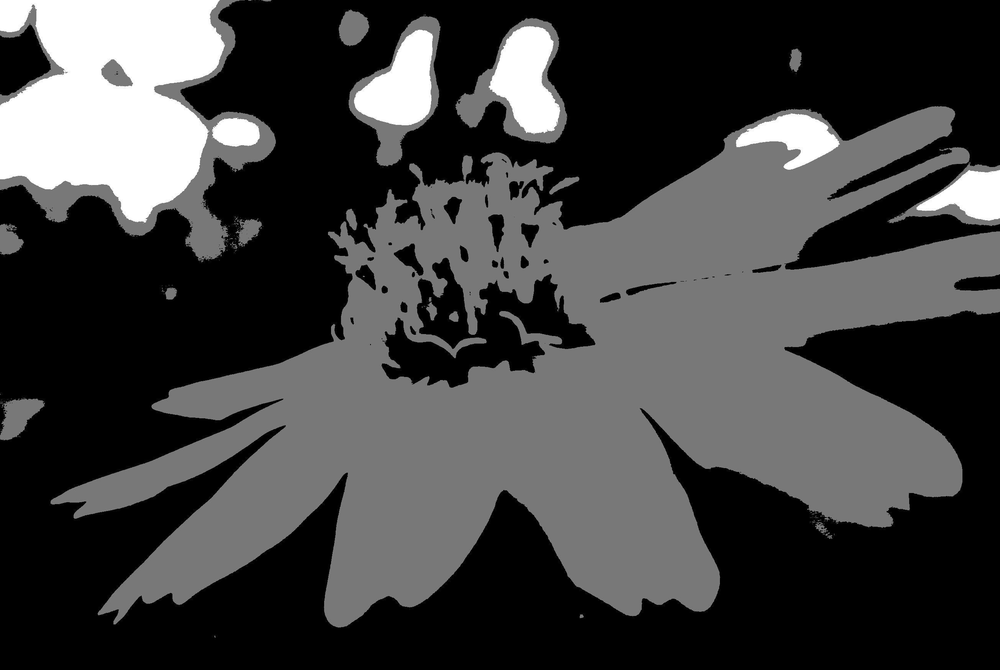

# Balanced Histogram Thresholding C
Implementation of BHT in C.

### How to Use
Dependencies: `png.h`

Clone: `git clone https://github.com/inventshah/Balanced-Histogram-Thresholding-C.git`

Compile: `./build.sh`

Run: `./bin/main [source filename]`

Open the `output` folder to see results

### Colorization
* **red** - if the red component is greater than the red threshold
* **green** - if the green component is greater than the green threshold
* **blue** - if the blue component is greater than the blue threshold
* **rgb** - combine the above three as seperate color channels
* **2 classes** - if the rgb components are all greater than the threshold
* **3 classes** - if the rgb components are all greater than or all less than the threshold

### Examples
source | red threshold | green threshold | blue threshold | rgb threshold | 2 classes | 3 classes
:-----:|:-------------:|:---------------:|:--------------:|:-------------:|:---------:|:--------:
 |  |  |  |  |  | 

### Built With
* C